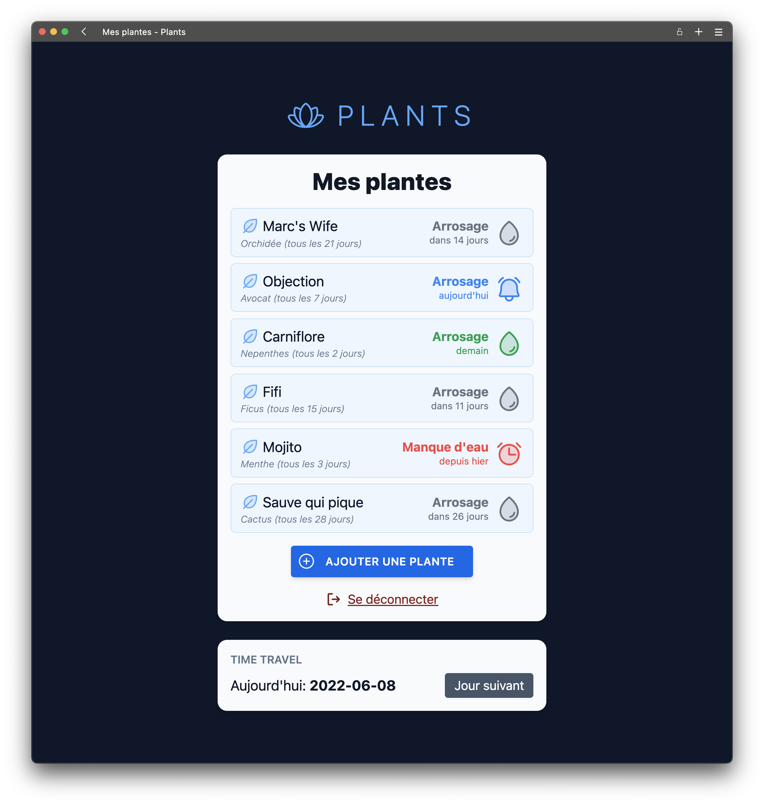
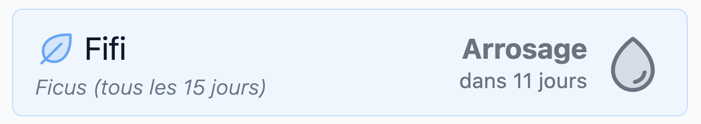
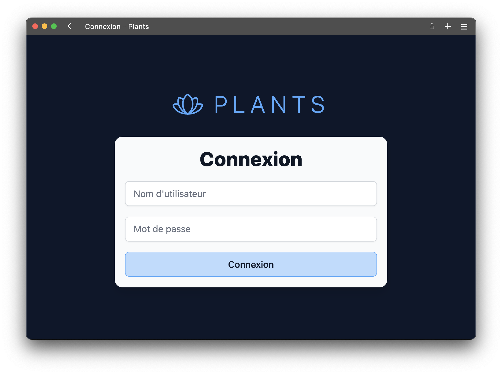
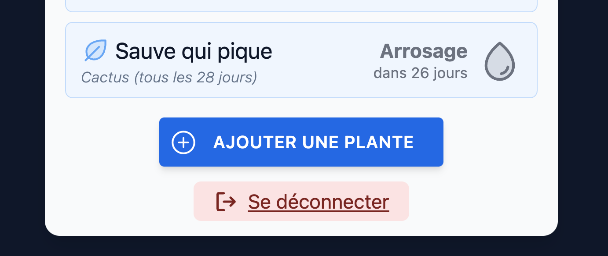
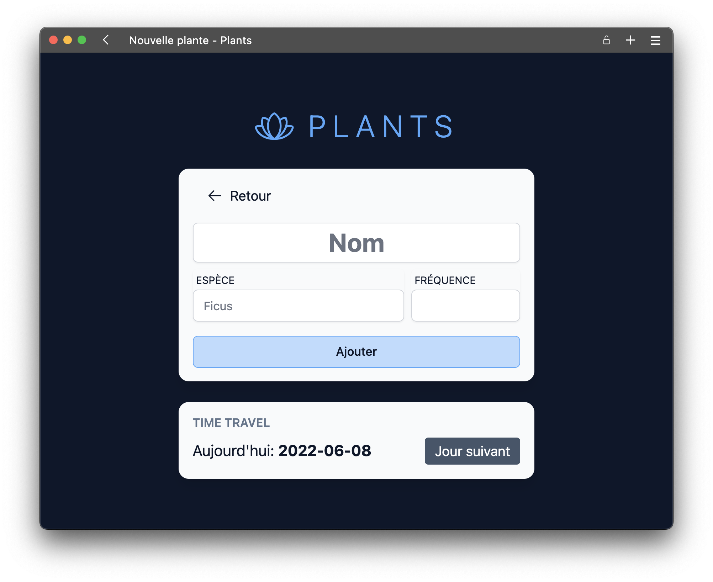
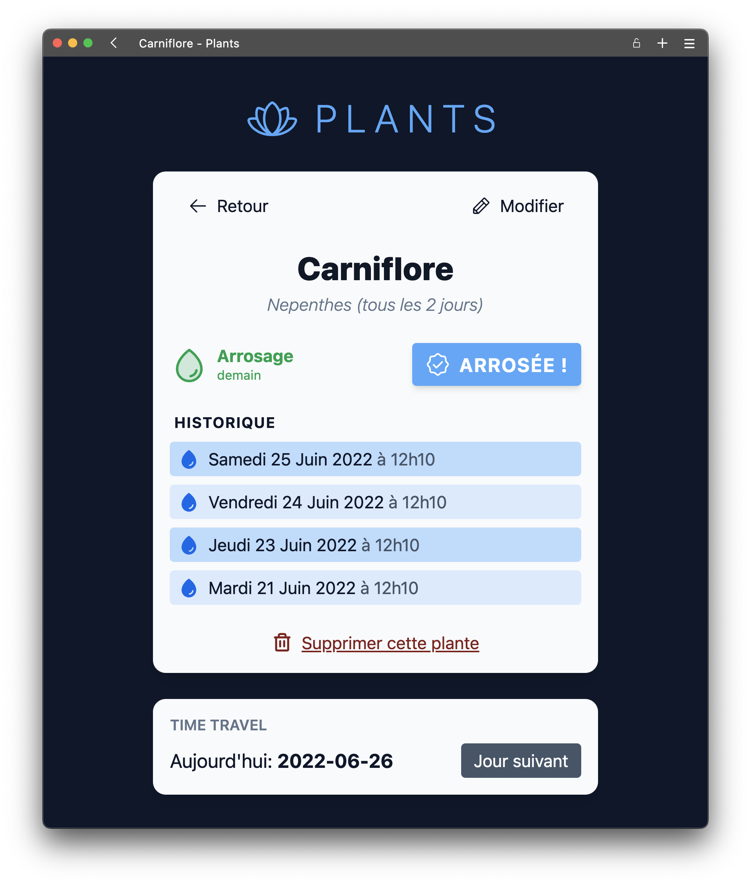
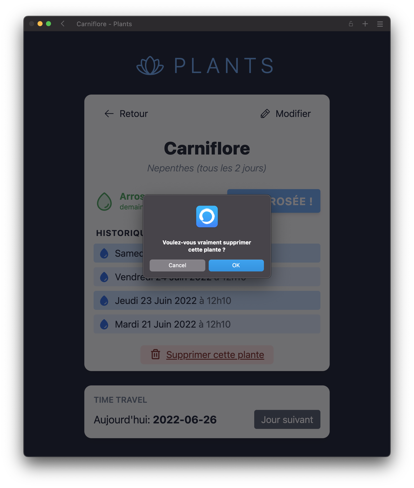
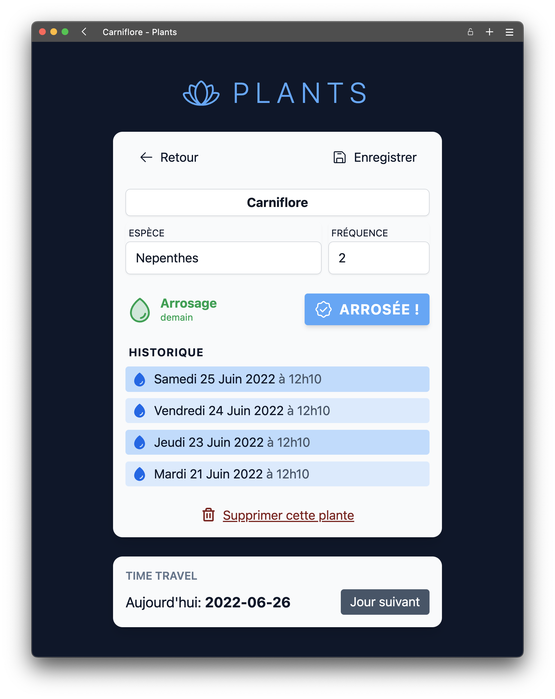
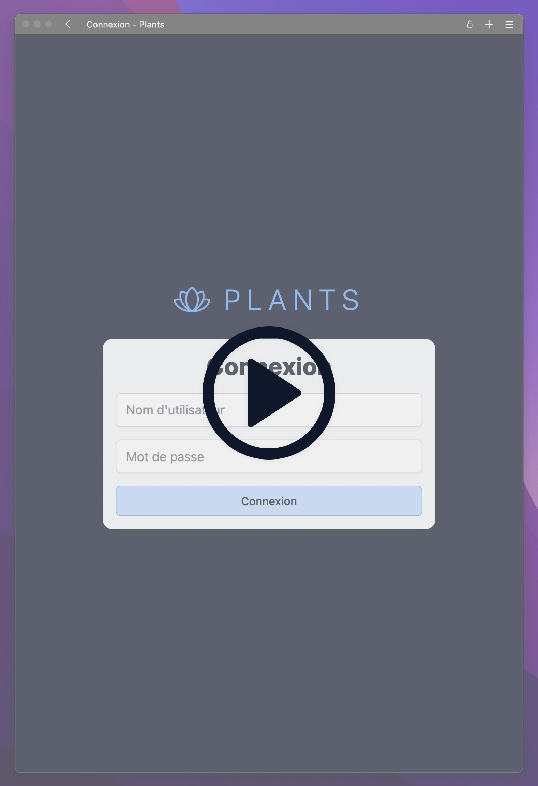

# TP - Plants

> Une application de suivi d'arrosage des plantes avec NextJS

## Initialisation

Une fois le projet de base récupéré, vous devez installer les dépendances avec `yarn`:

```bash
yarn install
```

Vous pouvez maintenant lancer l'application:

```bash
yarn dev
```

Ouvrez [http://localhost:3000/readme]() dans un navigateur pour la suite des instructions.

## Objectifs

Le but de ce TP est de développer une application de suivi d'arrosage des plantes.



## Fonctionnalités

**Remarque**: Il est conseillé d'implémenter les fonctionnalités dans l'ordre dans lequel elles sont décrites ci-dessous.

### Liste des plantes

La page d'accueil de l'application (`/`) affiche la liste des plantes.
Pour chaque plante on affiche son nom, son espèce, la fréquence d'arrosage et les statuts de l'arrosage.



### Arroser une plante

Au survol de la plante, un bouton **"ARROSÉE"**.
Lorsque l'on clique sur ce bouton, un appel API `POST` est fait sur `/api/watering` avec l'ID de la plante qui doit être arrosée.
Une fois la requête effectuée, la liste des plantes est mise à jour pour afficher le nouveau statut de l'arrosage.


### Connexion & Authentification

Pour accéder à la liste des plantes, l'utilisateur doit être authentifié.
Vous devrez donc mettre en place une page de connexion `/login` avec un formulaire de connexion (nom d'utilisateur et mot de passe).
Ce formulaire doit être validé avec un appel API `POST` sur `/api/login`.



Une fois l'utilisateur authentifié, il est redirigé vers la page d'accueil.

Si l'utilisateur n'est pas connecté, il doit être redirigé vers la page de connexion lorsqu'il tente d'accéder à la liste des plantes.
Pensez également à vérifier que l'utilisateur est bien authentifié lorsqu'il tente d'arroser une plante (route d'API) !

L'utilisateur doit également pouvoir se déconnecter grâce à un bouton **"Se déconnecter"** en bas de la page d'accueil.



### Ajouter une plante

Le bouton "Ajouter une plante" visible sur l'image ci-dessus renvoie l'utilisateur sur la page d'ajout de plante (`/new`).

Cette page comporte un formulaire avec le nom de la plante, son espèce et sa fréquence d'arrosage.



Une fois validées, les données du formulaire sont envoyées à l'API `/api/plant`. Une fois la requête effectuée, l'utilisateur est redirigé vers la page d'accueil.

### Historique des arrosages

Lorsque l'utilisateur clique sur le nom d'une plante sur la page d'accueil, il est redirigé vers une page dédiée à cette plante (`/plant/[plantId]`). Par exemple, une plante avec un ID `abcde12345` donnera l'URL `/plant/abcde12345`.

Cette page affiche de nouveau les informations de la plante, le statut de l'arrosage ainsi que la liste des arrosages de cette plante.



### Supprimer une plante

La page de détail d'une plante comporte un bouton "Supprimer cette plante". Au clic de ce bouton, on demande à l'utilisateur de valider la suppression avant d'appeler l'API `/api/delete-plant` en `POST` (avec l'ID de la plante en `body`).

Une fois la suppression effectuée, l'utilisateur est redirigé vers la page d'accueil.



### Éditer une plante

Sur la page de détail d'une plante, on trouve un bouton "Modifier" (en haut à gauche) qui permet de modifier les informations de la plante.
Lorsque l'utilisateur clique sur ce bouton, les informations de la plante sont affichées dans un formulaire et le bouton se transforme en "Enregistrer".



## Base de données

La base de données de l'application est fournie dans le projet de base, **vous n'avez donc pas besoin de le faire vous-même**.
La base de données utilise SQLite et est stockée dans le dossier `data`. Lors de la première exécution de l'application, la base de données sera créée si elle n'existe pas déjà.

**Remarque**: Lorsque la base de données est créée, des données sont automatiquement ajoutées.

À tout moment vous pouvez supprimer le dossier `data` et relancer l'application pour réinitialiser la base de données.

Pour manipuler la base de données, un certain nombre de fonctions sont disponibles dans le fichier `src/database/index.js`.

### Les fonctions disponibles

Les fonctions disponibles sont documentées dans le fichier `src/database/index.js`.

- `findUser`: Permet d'authentifier un utilisateur
- `findAllPlants`: Récupère la liste des plantes avec le nombre de jours avant le prochain arrosage
- `computePlantNextWatering`: Calcule le prochain arrosage d'une plante
- `findPlantById`: Trouve une plante par son id
- `updatePlantById`: Met à jour une plante
- `insertPlant`: Ajoute une plante
- `plantWatering`: Ajoute un arrosage pour une plante
- `removePlant`: Supprime une plante
- `findAllPlantWaterings`: Récupère les arrosages d'une plante

### Time Travel

Pour facilement tester l'application, le projet de base dispose d'un système de manipulation de la date actuelle.


Lorsque vous appuyez sur le bouton "Jour suivant", la date actuelle est modifiée (+1 jour).

**Remarque**: Vous ne pouvez pas revenir en arrière, mais vous réinitialisez la base de données (supprimer le dossier `data`) pour revenir à la date initiale.

## Démo Vidéo

[](./public/demo.webm "Vidéo de démo")

## Critères de notations (si applicable)

Vous serez évalué.e sur les critères suivants:

### Fonctionnalités _(6 points)_

- L'application se lance sans erreurs
- Les fonctionnalités décrites plus haut sont implémentées

### Qualité du code _(6 points)_

- Le code est correctement indenté
- Le code est commenté lorsque nécessaire
- Les variables ont des noms pertinents
- Les fichiers sont correctement structurés
- Le rendu correspond aux critères ci-dessous

#### Rendu

Vous devez rendre un fichier compressé (zip) contenant le code de l'application.

- Veillez à ne pas inclure les dossiers `node_modules`, `public` et `.next` (pour limiter la taille de l'archive).
- Le fichier devra être nommé `REACT_PLANTS_NOM_Prenom.zip`.
- Le rendu doit être envoyé avant la fin du cours.
- **Vous pouvez utiliser la commande `yarn run export-zip` pour créer automatiquement le fichier de rendu.**

### Convention utilisée _(8 points)_

- Vous avez utilisé les conventions et manières de faire étudiées en cours
  - Utilisation de `getServerSideProps`
  - `onSubmit` pour les formulaires
  - `useMutation` pour les appels APIs
  - `iron-session` pour manipuler les sessions et l'authentification

### Design & Finitions _(4 points bonus)_

La partie visuelle de l'application ne fait pas partie de l'application, mais peut rapporter des points bonus.

- L'application est stylisée
- Les erreurs sont gérées et affichées à l'utilisateur
